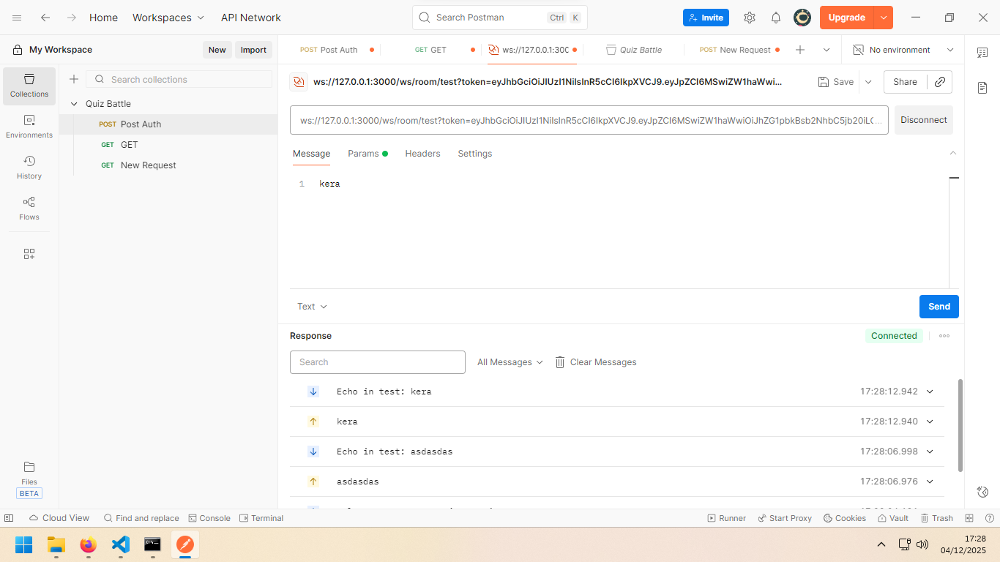

# Fastify + Prisma + Websocket + JWT Authentication (MVC Structure)

Project ini adalah boilerplate siap pakai menggunakan **Fastify**, **Prisma ORM **, **JWT Authentication**, **Websocket**, dan struktur **MVC modular**.

Cocok untuk membuat API modern, scalable, dan mudah di-maintain.

---



---


# 🛠 Instalasi

### 1. Clone / Download Project
```
git clone <repo>
cd project
```

### 2. Install dependencies
```
npm install
```

---

# ⚙️ Konfigurasi Environment

Buat file `.env`:

```
DATABASE_URL="mysql://root:@localhost:3306/test"
DATABASE_HOST="localhost"
DATABASE_PORT="3306"
DATABASE_USER="root"
DATABASE_PASSWORD=""
DATABASE_NAME="test"
JWT_SECRET="rahasia_jwt_apa_saja"
```

> Sesuaikan username, password, dan nama database.

---
Jika Model sudah di generate folder "prisma/client", apabila model diperbarui atau model ditambah , maka harus dihapus terlebih dahulu.
### Jalankan migrasi:
```
npx prisma migrate dev --name init
```

### Generate Prisma Client:
```
npx prisma generate
```

### Db Seed Prisma:
```
npx prisma db seed
```

---

# 🚀 Menjalankan Server
```
npm run dev
```
Server berjalan di:
```
http://localhost:3000
```

---

# 📡 API Endpoint

## 1. **Register User**
### **POST /auth/register**
Body:
```json
{
  "name": "kerokero",
  "email": "email@test.com",
  "password": "123456"
}
```
Response:
```json
{
  "id": 1,
  "name": "kerokero",
  "email": "email@test.com",
  "password": "<hashed>",
  "createdAt": "2025-01-01T00:00:00.000Z"
}
```

---

## 2. **Login User**
### **POST /auth/login**
Body:
```json
{
  "email": "admin@local.com",
  "password": "password"
}
```
Response:
```json
{
  "token": "<JWT_TOKEN>",
  "user": {
    "id": 1,
    "name": "Administrator",
    "email": "admin@local.com"
  }
}
```

---

## 3. **Profile User (Protected)**
### **GET /user/profile**
Headers:
```
Authorization: Bearer <JWT_TOKEN>
```
Response:
```json
{
  "id": 1,
  "name": "Administrator",
  "email": "admin@local.com",
  "createdAt": "2025-01-01T00:00:00.000Z"
}
```